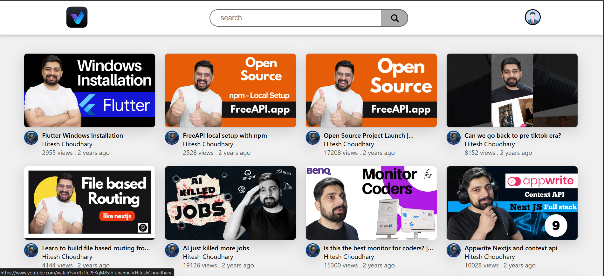

# YouTube Video Listing



Live Project Link - [https://chandanprogrammer.github.io/youtube-video-listing]

## Overview
This project is a simple web application that fetches and displays a list of YouTube videos from an API. Users can search for videos using a search bar and view essential details such as the video title, channel name, and view count.

## Features
- **Fetch YouTube Videos** from the API.
- **Display Video Thumbnails, Titles, and Channel Information**.
- **Search Functionality** to filter videos by title.
- **Clickable Video Links** that open the video on YouTube.
- **Displays View Count and Published Time**.

## API Endpoint
Videos are fetched from the following API:
```
https://api.freeapi.app/api/v1/public/youtube/videos?page=1&limit=100
```

## Technologies Used
- HTML
- CSS
- JavaScript

## Setup Instructions
1. Clone the repository:
   ```bash
   git clone https://github.com/chandanprogrammer/youtube-video-listing.git
   ```
2. Navigate to the project folder:
   ```bash
   cd youtube-video-listing
   ```
3. Open `index.html` in your browser.

## How It Works
1. When the page loads, videos are fetched from the API and displayed.
2. Users can search for specific videos using the search bar.
3. Clicking on a video redirects the user to YouTube to watch it.
4. Each video card displays the video title, channel name, view count, and time since it was published.

## Files Structure
```
project-folder/
│── images/          # images folder
│── index.html       # Main HTML file
│── style.css        # Styling file
│── script.js        # JavaScript file
└── README.md        # Project documentation
```
## Live Demo
Check out the live version of the project here: [YouTube Video Listing](https://chandanprogrammer.github.io/youtube-video-listing/)


